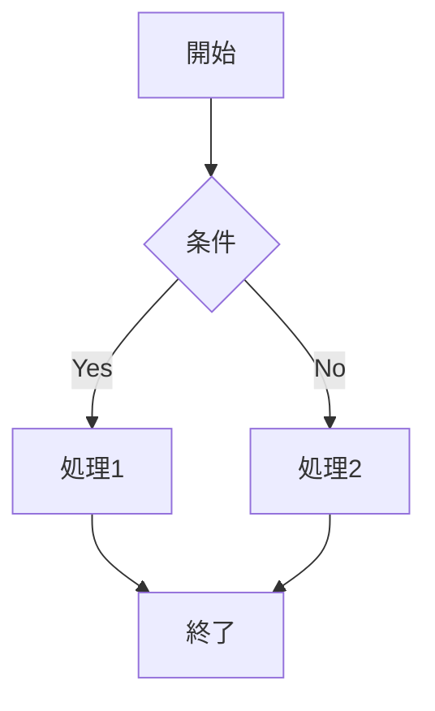
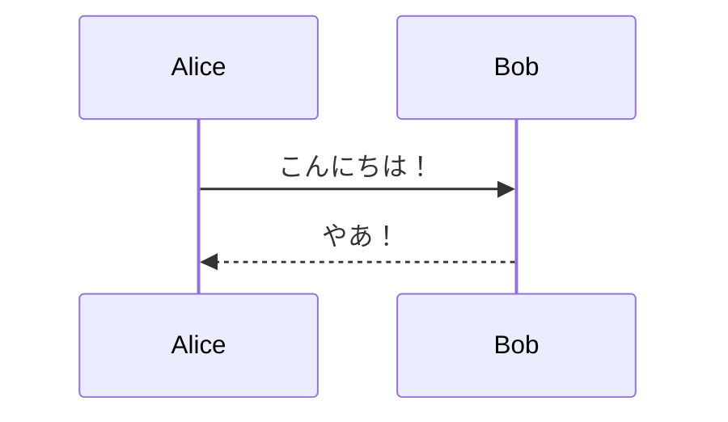
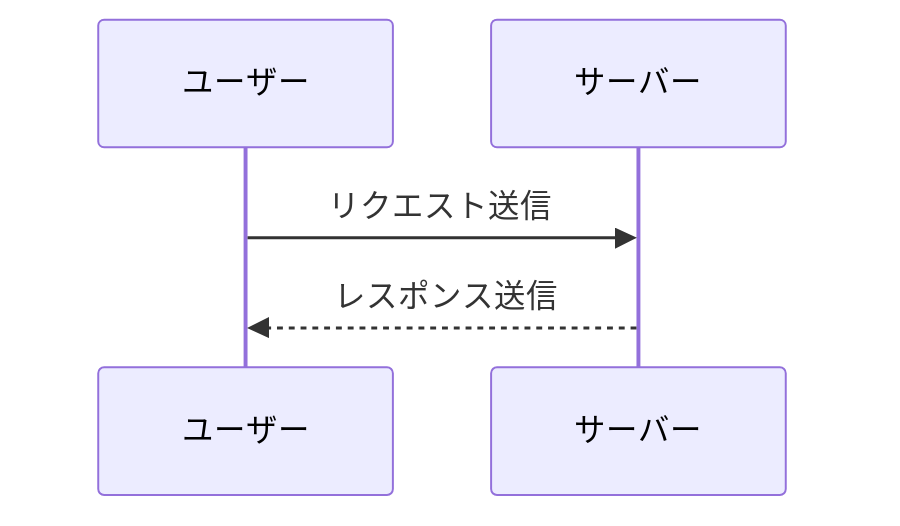
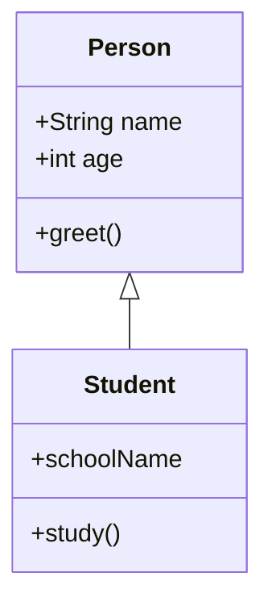
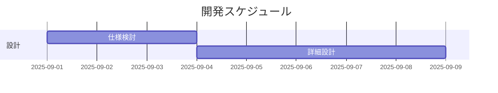
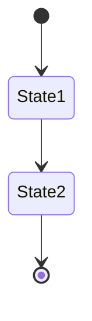
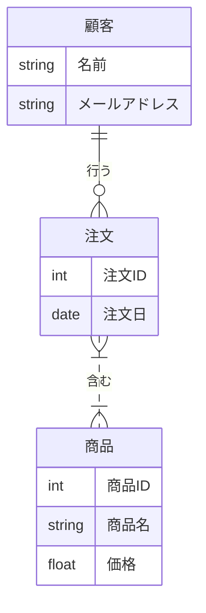
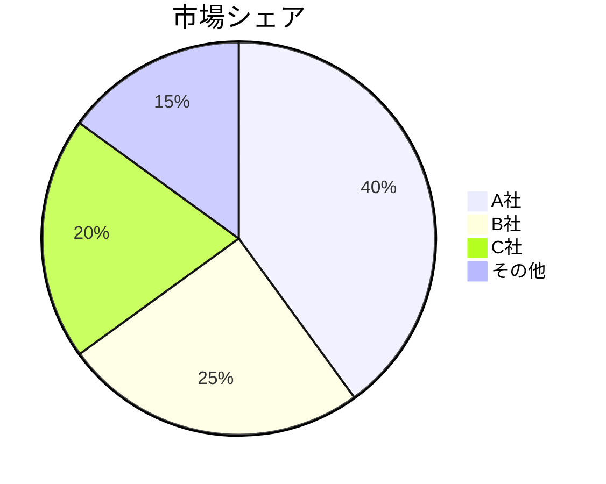
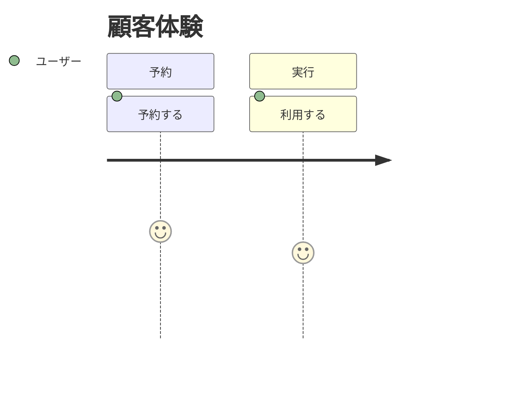

質問：mermaid記法について、概要と詳細な書き方（シーケンス図やフローチャートなど）を教えてください。

もちろんです！  
**Mermaid（マーメイド）記法**は、Markdown等のテキストベースの環境で、グラフや図（ダイアグラム）を記述できるシンプルな記法です。特にコードブロック内で `mermaid` を指定して図を記述します。

---

# Mermaid記法の概要

- **目的**：テキストで図（フローチャート、シーケンス図、クラス図など）を簡単に作成する。
- **特徴**：コードエディタやドキュメント内での可視化が容易。
- **対応例**：GitHub、Notion、Typoraなど多くのツールでサポート。

---

# 主なダイアグラム種類と書き方

## 1. フローチャート

### 基本構文

- `TD`：Top→Down（上から下へ）
- `A --> B`：AからBへの矢印
- `[ノード名]`：四角形のノード
- `{ノード名}`：ダイヤモンド（条件分岐）

### 方向指定
- TD：Top Down
- LR：Left to Right

## 2. シーケンス図

### 基本構文

- `participant 名`：登場人物の宣言
- `Alice->>Bob:`：AliceからBobへの通常メッセージ
- 矢印の種類 `->>`/`-->>`/`->` など強調(同期/非同期)の違い

### オプション例

## 3. クラス図

### 基本構文

- `class X`：クラス定義
- `+`：public、`-`：private
- 継承や関連： `<|--`（継承）、`-->`（関連）

## 4. ガントチャート

### 基本構文

## 5. 状態遷移図

## 6. ER図（エンティティ・リレーション図）

**Mermaid v10以降**で正式サポートされています。

### 基本構文

#### 主な記号
- `||--o{`：一対多（one-to-many）
- `}|..|{`：多対多（many-to-many）
- カラム定義は`エンティティ {}`内

---

## 7. パイチャート

### 基本構文

- `"ラベル"` : 数値 という形で割合を記述します。

---

## 8. その他 対応ダイアグラム 一覧

Mermaidでは以下のような図も記述できます（2024年時点）:

| No. | ダイアグラム名        | キーワード         | 例記法/説明                  |
|-----|----------------------|--------------------|------------------------------|
| 1   | フローチャート        | flowchart          | `flowchart TD ...`           |
| 2   | シーケンス図          | sequenceDiagram    | `sequenceDiagram ...`        |
| 3   | クラス図              | classDiagram       | `classDiagram ...`           |
| 4   | ガントチャート        | gantt              | `gantt ...`                  |
| 5   | 状態遷移図            | stateDiagram       | `stateDiagram-v2 ...`        |
| 6   | ER図（エンティティ図）| erDiagram          | `erDiagram ...`              |
| 7   | パイチャート          | pie                | `pie ...`                    |
| 8   | ジャーニーマップ      | journey            | `journey ...`                |
| 9   | 要件図                | requirementDiagram | `requirementDiagram ...`     |
| 10  | タイムライン          | timeline           | `timeline ...`               |
| 11  | Gitグラフ             | gitGraph           | `gitGraph ...`               |
| 12  | ワイヤーフレーム      | wireframe          | `wireframe ...`（実験的）      |

---

### 例：ジャーニーマップ

---

# 便利なポイント

- テキストで管理できるのでバージョン管理が容易
- 複数ツールで扱える
- プログラミングやドキュメントで作図作業が簡単

---

# 参考リンク

- [Mermaid公式ドキュメント](https://mermaid-js.github.io/mermaid/#/)
- [Cheat Sheet（英語）](https://mermaid-js.github.io/mermaid/#/n00b-cheat-sheet)

---
