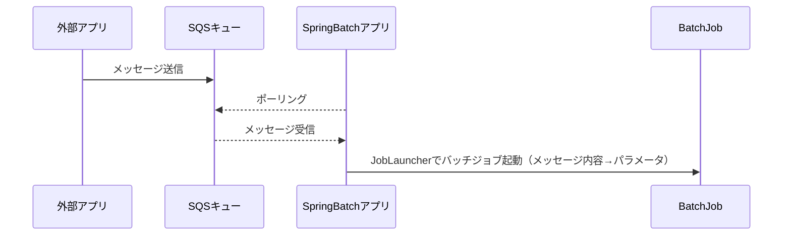

# 質問1

SQS連携による外部キューからバッチ起動について教えてほしいです。

---

もちろんです！  
**Spring Batch × AWS SQS × 外部キュー連携による非同期バッチ起動**について、全体像・パターン・実装イメージを日本語で丁寧にご説明します。

---

## 1. ゴール・想定するユースケース

- SQSに外部アプリからジョブ命令やリクエストが送信される
- Spring BatchアプリがSQSを定期ポーリングし、メッセージを受信したらパラメータ等を元にバッチジョブを非同期実行
- たとえば「この注文IDを処理して」や「特定の集計バッチを今すぐ走らせて」等

---

## 2. アーキテクチャと処理イメージ




---

## 3. 実現方法のポイント

### 必須要素
- **AWS SDK (SQSクライアント)**
- **SQSメッセージ・モデル**（JSONでジョブ名やパラメータを持たせる等）
- **Spring Batchでジョブ動的起動（JobLauncher API）**
- **ポーリング実装（@Scheduled／自作の永続ループでもOK）**

---

## 4. 実装イメージ（流れ）

### ① SQSクライアントとキュー設定

```java
@Bean
public SqsClient sqsClient() {
    return SqsClient.builder()
        .region(Region.AP_NORTHEAST_1) // ←Regionは自身のものに
        .build();
}
```


### ② SQSポーリング用サービス

```java
@Service
public class SqsPollingService {

    @Value("${aws.sqs.queue-url}")
    private String queueUrl;

    @Autowired
    private SqsClient sqsClient;
    @Autowired
    private JobLauncher jobLauncher;
    @Autowired
    private JobRegistry jobRegistry; // ジョブを名前から取得

    @Scheduled(fixedDelay = 5000)
    public void poll() {
        ReceiveMessageRequest request = ReceiveMessageRequest.builder()
                .queueUrl(queueUrl)
                .maxNumberOfMessages(5)
                .waitTimeSeconds(10)
                .build();
        ReceiveMessageResponse response = sqsClient.receiveMessage(request);
        for (Message msg : response.messages()) {
            try {
                // 例) { "jobName": "chunkDbJob", "params": {"inputValue": "SQS経由"} }
                SqsJobRequest sqsJob = parseMessage(msg.body());

                Job job = jobRegistry.getJob(sqsJob.getJobName());
                JobParametersBuilder builder = new JobParametersBuilder();
                builder.addString("SQS_REQ_TIME", Instant.now().toString());

                // パラメータもセット
                for (Map.Entry<String, String> entry : sqsJob.getParams().entrySet()) {
                    builder.addString(entry.getKey(), entry.getValue());
                }

                // ジョブを非同期で起動
                jobLauncher.run(job, builder.toJobParameters());

                // 正常終了ならSQSから削除
                sqsClient.deleteMessage(DeleteMessageRequest.builder()
                        .queueUrl(queueUrl)
                        .receiptHandle(msg.receiptHandle())
                        .build()
                );
            } catch (Exception e) {
                // エラーハンドリング／リトライ等
            }
        }
    }

    private SqsJobRequest parseMessage(String body) {
        // Jackson等でJSON→オブジェクト変換
    }
    // SqsJobRequestクラスはjobName, params (Map)を持つPOJO
}
```


### ③ ジョブ定義は通常通り
- Job/Step設計は既存のSpring Batch流儀に則る
- 実行パラメータとしてSQSメッセージの内容が渡る

---

## 5. ポイント解説・運用Tips

- **冪等性**: 同じSQSメッセージが複数回届く可能性を考え、JobParametersにユニークな値を混ぜる（例:`SQS_REQ_TIME`等）
- **メッセージ削除**: ジョブ起動「できた時のみ」SQSからdelete（失敗時はvisibility timeout等で再送制御）
- **複数ジョブ管理**: `jobRegistry.getJob(jobName)`で外部指定ジョブを柔軟に呼び分け可

---

## 6. 応用イメージ

- バッチの負荷/件数に応じて最大同時実行数やSQSキュー属性調整も可能
- Spring Cloud AWSやSpring Integrationを使えば、もっと宣言的に書くこともできますが、  
**ビジネス要件重視 or 柔軟制御したい場合は上記のようなシンプルな実装がおすすめ**です

---

## 7. まとめ

- **SQS連携でバッチの外部起動を実現する場合、ポイントは「ポーリング→パラメータ取り出し→JobLauncherで動的起動」**
- AWS認証やエラーリトライ、モニタリングの仕組みは運用要件に合わせて拡張できます

---

### 必要であれば

- 詳細なソースコード例
- SQS送信用スクリプト例
- Job/Stepパターンや運用Tips

などもご案内可能です。どうぞご相談ください！

# 質問2

`必要であれば` に示した内容もぜひ案内してほしいです。

---

もちろんです！  
**SQS連携バッチの運用Tips・詳細サンプル**を「詳細ソース例」「キュー送信用サンプル」「Job/Stepパターン」「バッチ運用Tips」までまとめて解説します。

---

## 1. 詳細なソースコード例（SQSポーリング & ジョブ起動）

### 1-1. SQSメッセージモデル

```java
// SqsJobRequest.java
import java.util.Map;

public class SqsJobRequest {
    private String jobName;
    private Map<String, String> params;

    // getter/setter...
}
```


### 1-2. SQSポーリングサービス実装

```java
// SqsPollingService.java
import com.fasterxml.jackson.databind.ObjectMapper;
import org.springframework.batch.core.*;
import org.springframework.batch.core.launch.JobLauncher;
import org.springframework.batch.core.configuration.JobRegistry;
import org.springframework.beans.factory.annotation.Value;
import org.springframework.scheduling.annotation.Scheduled;
import org.springframework.stereotype.Service;
import software.amazon.awssdk.services.sqs.SqsClient;
import software.amazon.awssdk.services.sqs.model.*;

import java.time.Instant;
import java.util.Map;

@Service
public class SqsPollingService {

    @Value("${aws.sqs.queue-url}")
    private String queueUrl;

    private final SqsClient sqsClient;
    private final JobLauncher jobLauncher;
    private final JobRegistry jobRegistry;
    private final ObjectMapper objectMapper = new ObjectMapper();

    public SqsPollingService(SqsClient sqsClient, JobLauncher jobLauncher, JobRegistry jobRegistry) {
        this.sqsClient = sqsClient;
        this.jobLauncher = jobLauncher;
        this.jobRegistry = jobRegistry;
    }

    @Scheduled(fixedDelay = 5000)
    public void poll() {
        ReceiveMessageRequest request = ReceiveMessageRequest.builder()
                .queueUrl(queueUrl)
                .maxNumberOfMessages(3)
                .waitTimeSeconds(5)
                .build();

        ReceiveMessageResponse response = sqsClient.receiveMessage(request);

        for (Message msg : response.messages()) {
            try {
                SqsJobRequest sqsJob = parseMessage(msg.body());

                Job job = jobRegistry.getJob(sqsJob.getJobName());
                JobParametersBuilder builder = new JobParametersBuilder();
                builder.addString("SQS_REQ_TIME", Instant.now().toString());

                for (Map.Entry<String, String> entry : sqsJob.getParams().entrySet()) {
                    builder.addString(entry.getKey(), entry.getValue());
                }

                jobLauncher.run(job, builder.toJobParameters());

                sqsClient.deleteMessage(DeleteMessageRequest.builder()
                        .queueUrl(queueUrl)
                        .receiptHandle(msg.receiptHandle())
                        .build()
                );
            } catch (Exception e) {
                System.out.println("SQSメッセージ処理例外: " + e.getMessage());
            }
        }
    }

    private SqsJobRequest parseMessage(String body) throws Exception {
        return objectMapper.readValue(body, SqsJobRequest.class);
    }
}
```


### 1-3. ジョブ定義例（tasklet・chunk共通）

例：「inputValueパラメータを受けてMySQLのmessagesテーブルへ登録（Tasklet例）」

```java
@Bean
public Step sqsStep(JobRepository repo, PlatformTransactionManager tx, JdbcTemplate jdbc) {
    return new StepBuilder("sqsStep", repo)
        .tasklet((c, chunkCtx) -> {
            String val = (String) chunkCtx.getStepContext().getJobParameters().get("inputValue");
            jdbc.update("INSERT INTO messages (text, processed_at) VALUES (?, NOW())", val);
            return RepeatStatus.FINISHED;
        }, tx).build();
}

@Bean
public Job sqsJob(JobRepository repo, Step sqsStep) {
    return new JobBuilder("sqsJob", repo)
        .start(sqsStep)
        .build();
}
```

> chunkモデルも実装できます。

---

## 2. SQS送信用スクリプト（例：AWS CLI／curl）

### 2-1. SQSメッセージJSON例

```json
{
  "jobName": "sqsJob",
  "params": {
    "inputValue": "SQS経由メッセージ登録"
  }
}
```


### 2-2. AWS CLIで送る例

```textmate
aws sqs send-message \
 --queue-url https://sqs.ap-northeast-1.amazonaws.com/xxx/your-queue \
 --message-body '{
   "jobName": "sqsJob",
   "params": {
     "inputValue": "SQS経由メッセージ登録"
   }
 }'
```


### 2-3. curl + curl-to-aws-proxyなLambdaやAPI Gateway経由なども可能です。

---

## 3. Job/Stepパターン例

- **1ジョブ1テーブルInsert**: 上記例のような単純Insert
- **複数Stepによる多段処理**  
  1. Step1: SQSで受信したパラメータを元にファイルDL  
  2. Step2: DLしたファイルをパース・集計  
  3. Step3: サマリーをDB登録

- **Chunkモデルで件数大量時**  
  ItemReaderでSQSパラメータをフィルタ条件にしてDBからデータ取得 → ItemWriterで分割Insert更新

---

## 4. バッチ運用Tips

- **同一パラメータの重複起動対策**
  - SQS_REQ_TIMEなどユニーク性をJobParametersへ加えることで、ジョブ履歴をSpringBatchの管理テーブルで重複区別
- **失敗時の再送・リトライ設計**
  - SQSのVisibility Timeout＆DLQ(Dead Letter Queue)設定を活用  
- **ログ監視/運用保守**
  - Spring BatchのDB管理テーブル（BATCH_JOB_EXECUTION など）でジョブ実行履歴・異常検出
- **パラメータ妥当性検証**
  - SqsPollingService側で最低限のバリデーションや不正リクエスト検知
- **複数ジョブ・パラメータ設計**
  - パラメータ名の変更・増減もJSONメッセージ側で柔軟に可能
- **Test戦略**
  - SQS→バッチまでの「E2Eテスト」を用意：テストキューやローカルのElasticMQでテスト推奨

---

## 5. ローカル開発Tips

- **ElasticMQ（Docker等）を使ってローカルSQSサーバを用意すると手軽にSQS検証可能**  
  例：
```textmate
docker run -d -p 9324:9324 softwaremill/elasticmq-native
```


---

## 6. まとめのひとこと

- **SQS × Spring Batchは多様なバッチ外部連携に強い選択肢！運用要件や現場のSREとも連携すると更に安定・高可用！**
- 例をベースに実システム要件に合わせて「複雑なジョブ分岐」や「監査対応」「再送制御」等、拡張していくとよいでしょう。

---

更に具体的な実装部分や運用設計ご相談もお気軽にどうぞ！
