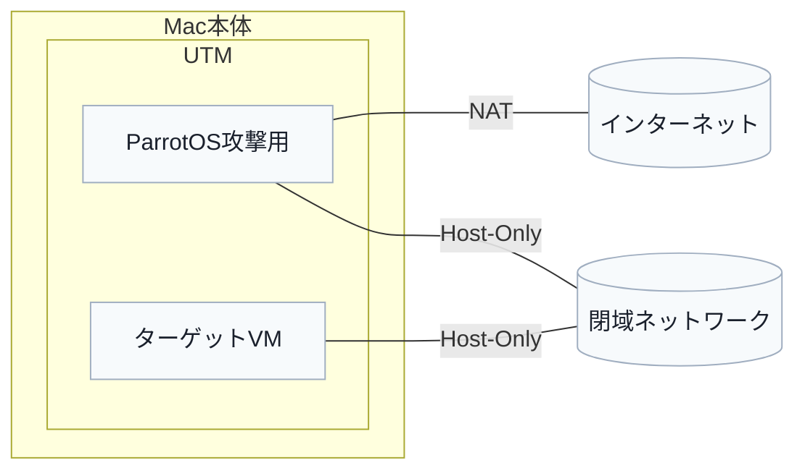

## UTM（macOS）上での攻撃環境（ParrotOS）・ターゲット環境のネットワーク設計と切り替え手順

---

### 目的

- **攻撃用VM（ParrotOS）**と**ターゲットVM**を同一Mac上に用意
    - **ParrotOS**：NAT(外部ネット)とホストオンリー(閉域)を用途に応じて切り替えたい
    - **ターゲットVM**：閉じたネットワーク内（ホストオンリーアダプター）で運用したい

---

### 設計概要

1. **仮想ネットワークを2種類用意**
    - **NATネットワーク**
        - インターネット接続用
        - 例：10.0.2.0/24
    - **ホストオンリーネットワーク**
        - 閉域環境用
        - 例：192.168.56.0/24

2. **VMごとのNIC構成**
    - **ParrotOS（攻撃用）**
        - NIC1：NAT（インターネット接続用）
        - NIC2：ホストオンリー（閉域/ターゲット専用接続）
    - **ターゲットVM**
        - NIC1：ホストオンリーのみ

---

### ネットワーク構成図（外観）



- P-OS: ParrotOS攻撃用
- T-VM: ターゲットVM
- 切替はParrotOSのif操作で可能

---

### UTMでの設定手順

#### 1. 各VMのNIC設定（グローバル作成は不要）
- **ParrotOS**
    - 「ネットワーク」タブでNICを2枚にする
        - NIC1：ネットワークモード＝共有ネットワーク（NAT）
        - NIC2：ネットワークモード＝ホストのみ、Host Network＝Default (private)
- **ターゲットVM**
    - NIC1：ネットワークモード＝ホストのみ、Host Network＝Default (private)
    - 共有ネットワークやブリッジは追加しない

---

### ParrotOS内での切り替え操作

- 基本は従来どおり（IFのup/downとルート調整）
    - 閉域モード：NAT側IFをdown、Host-Only側IFはup
    - インターネット利用：NAT側IFをup（デフォルトルートはNAT側のみ）
- 補足：UTM側での切替
    - VM停止中に、ParrotOSのNIC1を一時的に無効化/削除、またはネットワークモードをNAT⇔ホストのみで切替も可
    - ただし停止が必要なため、迅速な運用はIF切替を推奨

#### 1. **インターフェース名の確認**
- `ip addr` コマンドで各IFの名前（例：ens3=NAT, ens4=Host-Only）を確認

#### 2. **IPアドレスの設定**
- NAT：DHCPで自動設定（通常OK）
- Host-Only：UTM Host-OnlyのDHCPを使うか静的割当  
  例: `192.168.56.10/24`

#### 3. **切り替え方法（NAT⇔ホストオンリー）**
- 【ターゲット環境だけ攻撃する閉域モード】
    - NAT側IF（例: ens3）をdown
    - Host-Only側IF（例: ens4）はup

```shell script
sudo nmcli dev disconnect ens3
sudo nmcli con up <hostonly-profile>
```

- 【インターネットが必要な場合】
    - NAT側IFをup  
    - 必要であればHost-Only側IFをdown

```shell script
sudo nmcli con up <nat-profile>
sudo nmcli dev disconnect ens4  # 必要に応じて
```

- **ルーティングの確認/調整**
    - `ip route` コマンド
    - デフォルトルートがNAT側のみになるよう調整
    - 閉域中はデフォルトルートを削除

```shell script
sudo ip route del default dev ens3
```

#### 4. **ネットワークプロファイルによる簡単切替†**
- NetworkManagerなどで
    - `nat-online`（NAT only）
    - `lab-isolated`（Host-Onlyのみ）  
      のように複数プロファイルを作成し、`nmcli`でワンタッチ切替  
      例:

```shell script
sudo nmcli con up nat-online
sudo nmcli con up lab-isolated
```


---

### ターゲットVMの閉域化・隔離

- ターゲットVMにはNATやBridged NICを絶対に追加しない
- ゲートウェイ/DNSは Host-Onlyネットワーク内のみに設定
- ParrotOSでIP転送やNATを実施しない限り、ターゲットが外部に出ることはない

---

### （任意）ParrotOSから中継する場合（普段は無効推奨）

- IP転送を有効化  
  `sudo sysctl -w net.ipv4.ip_forward=1`
- NAT（iptables例）
```shell script
sudo iptables -t nat -A POSTROUTING -o ens3 -j MASQUERADE
```

- 使用後は必ず無効化

---

### トラブル対策

- **DHCPでIPが振られない**：UTM Host-OnlyネットのDHCP設定範囲を確認。静的割当も可。
- **ルート不整合**：`nmcli`等でmetricを調整
- **IF名が変化する**：固定MACやudevルールで解決可

---

**この手順により、「ParrotOSのみNATとホストオンリーを切り替えたり」「ターゲットVMは常時閉域・孤立」させたまま、柔軟なネットワーク運用ができます！**
