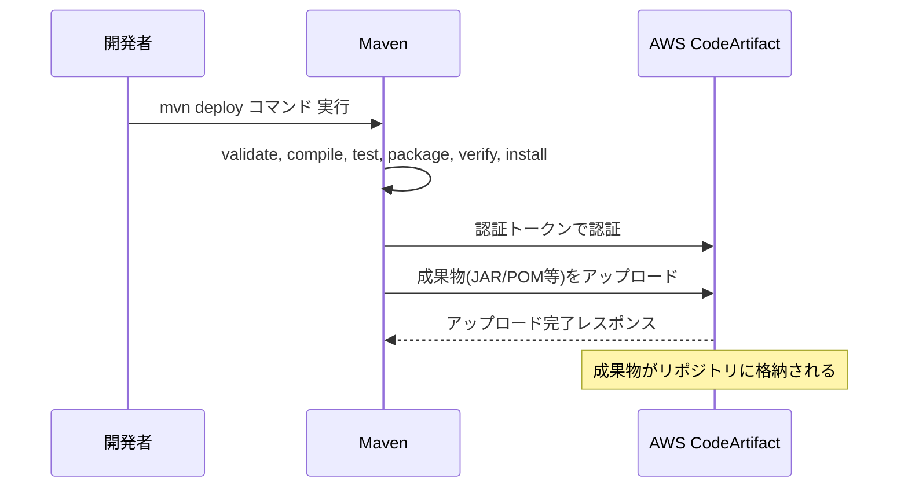

# 1. 基礎知識

Mavenに関する基本的な知識を記述する。

## 1.1. ビルドライフサイクル

`mvn deploy`は、Mavenの「デプロイ」フェーズまでの全ての標準ライフサイクル（validate, comple, test, package, verify, install, deploy）を順番に実行する。

| No. | ライフサイクル | 説明                                                              |
| ----: | ---------------- | ------------------------------------------------------------------- |
|   1 | validate       | プロジェクトが正しく記述されているか検証                          |
|   2 | compile        | ソースコードのコンパイル                                          |
|   3 | test           | 単体テストの実行(JUnit5, Mockitoなど)                             |
|   4 | package        | JARやWARなど成果物の作成                                          |
|   5 | verify         | 成果物の検証                                                      |
|   6 | install        | 成果物をローカルリポジトリ(`~/.m2/repository`)にインストール      |
|   7 | deploy         | 成果物をリモートリポジトリ(例:AWS CodeArtifactなど)にアップロード |

## 1.2. deployフェーズの詳細

- `pom.xml`で指定されたリモートリポジトリ(`distributionManagement`セクションで指定)に、ビルド成果物(JAR/WAR、POMファイル、ソースJARなど)をアップロードする。
- これにより、他の開発者やCI/CDパイプラインが、そのリモートリポジトリから成果物を利用できるようになる。

## 1.3. 典型的な利用シーン

- **社内共通ライブラリの配布:**
  AP基盤開発者が作成した共通フレームワーク/ライブラリを、業務開発者が各プロジェクトで利用できるようにする場合など。

## 1.4. 注意点

- `deploy`は通常、**スナップショット版(開発中ver)** と **リリース版(本番用ver)** でリポジトリの扱いが異なる。
- AWS CodeArtifactなどのリモートリポジトリにアップロードするには、認証情報やリポジトリURLの設定が必要。

# 2. Mavenコマンド

よく使うMavenコマンドとオプションについてまとめる。

## 2.1. 主要なコマンド一覧

複数同時に指定することも可能。 例： `mvn clean install`


| コマンド名                            | 挙動・説明                                        |
| --------------------------------------- | --------------------------------------------------- |
| `clean`                               | ビルド成果物(targetディレクトリ)                  |
| `compile`                             | ソースコードをコンパイルし、クラスファイルを生成  |
| `test`                                | テストコードをコンパイルし、テストを実行          |
| `package`                             | プロジェクトをビルドし、JAR/WARなどの成果物を作成 |
| `install`                             | 成果物をローカルリポジトリにインストール          |
| `deploy`                              | 成果物をリモートリポジトリにデプロイ              |
| `site`                                | プロジェクトのレポートサイト(ドキュメント)を生成  |
| `dependency:tree`                     | 依存関係のツリーを表示                            |
| `help:effective-pom`                  | 実際に適用されるPOM(effective POM)を表示          |
| `archetype:generate`                  | 新しいMavenプロジェクトの雛形(アーキタイプ)を作成 |
| `versions:display-dependency-updates` | 依存ライブラリのアップデート情報を表示            |
| `exec:java`                           | Javaアプリケーションを実行                        |
| `spring-boot:run`                     | Spring Bootアプリケーションを起動                 |
| `dependency:copy-dependencies`        | 依存JARファイルをコピー                           |

## 2.2. オプション

mvnコマンドで利用可能な主なオプションとその役割をまとめる。


| オプション・パラメータ           | オプションの役割                                                                 | 対象                                |
| ---------------------------------- | ---------------------------------------------------------------------------------- | ------------------------------------- |
| `-Dproperty-value`               | システムプロパティやプラグイン/ビルドのパラメータを指定                          | 全てのmvnコマンド                   |
| `-pプロファイル名`               | Mavenプロファイルを有効化(pom.xmlやsettings.xmlで定義したプロファイルを切り替え) | 全てのmvnコマンド                   |
| `-f path/to/pom.xml`             | 使用するpom.xmlファイルのパスを指定                                              | 全てのmvnコマンド                   |
| `-pl モジュール名`               | マルチモジュールプロジェクトで、対象とするモジュールを指定                       | 全てのmvnコマンド                   |
| `-am` (依存モジュールもビルド)   | `-pl`と併用し、指定したモジュールが依存する他のモジュールも合わせてビルド        | 全てのmvnコマンド                   |
| `-U` (スナップショット更新)      | SNAPSHOTバージョンの依存をリモートリポジトリから強制的に取得                     | 全てのmvnコマンド                   |
| `-X` (デバッグ出力)              | デバッグ情報を詳細に出力                                                         | 全てのmvnコマンド                   |
| `-e` (例外詳細出力)              | エラー発生時に例外の詳細スタックトレースを出力                                   | 全てのmvnコマンド                   |
| `-q` (静かな出力)                | ログ出力を最小限に抑える(quietモード)                                            | 全てのmvnコマンド                   |
| `-B` (バッチモード)              | 対話的な入力を無効化し、CI/CD等の自動化向けにバッチモードで実行                  | 全てのmvnコマンド                   |
| `-Dtest=クラス名`                | 実行するテストクラスやメソッドを指定                                             | `test`                              |
| `DfailIfNoTests=false`           | テストが存在しない場合でもビルド失敗としない                                     | `test`                              |
| `-DskipTests`                    | テストの実行をスキップ                                                           | `test` `package` `install` `deploy` |
| `-Dmaven.test.failure.ignore`    | テスト失敗時もビルドを継続                                                       | `test` `package` `install` `deploy` |
| `-Dincludes=groupId:ar†ifactId` | 依存関係ツリー表示時に特定の依存のみを対象にする                                 | `dependency:tree`                   |
| `-Dverbose`                      | 依存関係ツリーなどで詳細情報を出力                                               | `dependency:tree`                   |
| `-DinteractiveMode=false`        | 対話モードを無効化し、全ての入力をコマンドラインで指定                           | `archetype:generate`                |
| `-DgroupId=...`                  | 新規プロジェクト作成時のgroupIdを指定                                            | `archetype:generate`                |
| `-DartifactId=...`               | 新規プロジェクト作成時のartifactIdを指定                                         | `archetype:generate`                |
| `-Dversion=...`                  | 新規プロジェクト作成時のversionを指定                                            | `archetype:generate`                |
| `-DmainClass=...`                | 実行するJavaクラスのFQCN(完全修飾名)を指定                                       | `exec:java`                         |
| `-Dspring-boot.run.profiles=...` | Spring Bootアプリ起動時に有効化するプロファイルを指定                            | `spring-boot:run`                   |
| `-DoutputDirectory=...`          | 依存JARファイルのコピー先ディレクトリを指定                                      | `dependency:copy-dependencies`      |

# 3. POMファイル

Mavenプロジェクトにおけるライブラリの依存関係は`pom.xml`に記載する。

## 3.1. `pom.xml`タグの親子関係


| 親タグ                     | 子タグ(複数可)             | 詳細説明                                                                    |
| ---------------------------- | ---------------------------- | ----------------------------------------------------------------------------- |
| `<project>`                | `<modelVersion>`           | POMファイルのバージョン。通常は"4.0.0"。                                    |
|                            | `<parent>`                 | 親POMを指定。共通設定や依存管理を親POMにまとめる場合に使用。                |
|                            | `<groupId>`                | プロジェクトのグループID。組織やドメイン名などを指定。                      |
|                            | `<artifactId>`             | プロジェクトのアーティファクトID。成果物(JAR等)の名前になる。               |
|                            | `<version>`                | プロジェクトのバージョン。                                                  |
|                            | `<packaging>`              | 成果物のパッケージ形式(jar, war, pomなど)。省略時はjar。                    |
|                            | `<name>`                   | プロジェクトの表示名。                                                      |
|                            | `<description>`            | プロジェクトの説明。                                                        |
|                            | `<url>`                    | プロジェクトのWebサイトやリポジトリURL。                                    |
|                            | `<properties>`             | Mavenプロパティ(変数)の定義。バージョンや共通値をまとめて管理。             |
|                            | `<dependencyManagement>`   | 依存ライブラリのバージョンやスコープなどを一元管理するためのセクション。※1 |
|                            | `<dependencies>`           | 依存ライブラリの一覧。                                                      |
|                            | `<build>`                  | ビルドに関する設定(プラグインや出力先など)。                                |
|                            | `<repositories>`           | 依存ライブラリを取得するリポジトリの定義。                                  |
|                            | `<distributionManagement>` | 成果物をデプロイするリポジトリ(例:CodeArtifact)の定義。                     |
|                            | `<profiles>`               | ビルド時に切り替え可能なプロファイルの定義。                                |
|                            | `<modules>`                | マルチモジュールプロジェクトでの子モジュール一覧。                          |
| `<properties>`             | (プロパティ名)             | 任意のプロパティ(例:`<java.version>23</java.version>`)を定義。              |
| `<dependencyManagement>`   | `<dependencies>`           | 管理対象とする依存ライブラリの定義。                                        |
| `<dependencies>`           | `<dependency>`             | 個々の依存ライブラリの定義。                                                |
| `<dependency>`             | `<groupId>`                | 依存ライブラリのグループID。                                                |
|                            | `<artifactId>`             | 依存ライブラリのアーティファクトID。                                        |
|                            | `<version>`                | 依存ライブラリのバージョン。                                                |
|                            | `<scope>`                  | 依存範囲(compile, test, provided, runtime, systemなど)。※2                 |
|                            | `<type>`                   | パッケージの種類(jar, warなど)。省略時はjar。                               |
|                            | `<classifier>`             | 分類子。成果物のバリアントを指定する場合に使用。                            |
|                            | `<exclusions>`             | 依存ライブラリから除外する依存関係の指定。                                  |
| `<dependencies>`           | `<dependency>`             | 個々の依存ライブラリの定義。                                                |
| `<dependency>`             | `<groupId>`                | 依存ライブラリのグループID。                                                |
|                            | `<artifactId>`             | 依存ライブラリのアーティファクトID。                                        |
|                            | `<version>`                | 依存ライブラリのバージョン。                                                |
|                            | `<scope>`                  | 依存範囲(compile, test, provided, runtime, systemなど)。※2                 |
| `<build>`                  | `<plugins>`                | 使用するMavenプラグインの定義。                                             |
| `<plugins>`                | `<plugin>`                 | 個々のMavenプラグインの定義。                                               |
| `<plugin>`                 | `<groupId>`                | プラグインのグループID。                                                    |
|                            | `<artifactId>`             | プラグインのアーティファクトID。                                            |
|                            | `<version>`                | プラグインのバージョン。                                                    |
|                            | `<configuration>`          | プラグイン固有の設定。                                                      |
| `<repositories>`           | `<repository>`             | 依存ライブラリを取得するリポジトリの定義。                                  |
| `<repository>`             | `<id>`                     | リポジトリの識別子。                                                        |
|                            | `<url>`                    | リポジトリのURL。                                                           |
|                            | `<releases>`               | リリース版の取得設定。                                                      |
|                            | `<snapshots>`              | スナップショット版の取得設定。                                              |
| `<distributionManagement>` | `<repository>`             | リリース成果物のデプロイ先リポジトリ。                                      |
|                            | `<snapshotRepository>`     | スナップショット成果物のデプロイ先リポジトリ。                              |
| `<profiles>`               | `<profile>`                | プロファイル定義。                                                          |
| `<profile>`                | `<id>`                     | プロファイルの識別子。                                                      |
|                            | `<activation>`             | プロファイルの有効化条件。                                                  |
|                            | `<properties>`             | プロファイル固有のプロパティ。                                              |
|                            | `<dependencies>`           | プロファイル固有の依存ライブラリ。                                          |
|                            | `<build>`                  | プロファイル固有のビルド設定。                                              |
| `<modules>`                | `<module>`                 | サブモジュール名。                                                          |

※1: 主に親POMやマルチモジュールプロジェクトで利用される。

※2: `<scope>`タグで指定できる値は以下のとおり。


| 値         | 用途・意味                                                                                 | 典型的な利用例                      |
| ------------ | -------------------------------------------------------------------------------------------- | ------------------------------------- |
| `compile`  | デフォルト値。全てのクラスパス(コンパイル、テスト、実行、パッケージング)で利用される。     | Spring, MyBatisなどの本番依存       |
| `provided` | コンパイル時とテスト時のみ利用。実行時は外部(サーバ等)が提供するため、成果物には含めない。 | サーブレットAPI、Tomcat依存など     |
| `runtime`  | 実行時とテスト時のみ利用。コンパイル時には不要。                                           | JDBCドライバなど                    |
| `test`     | テスト時のみ利用。コンパイルや実行時にはクラスパスに含まれない。                           | JUnit, Mockitoなどのテスト依存      |
| `system`   | `provided`に似ているが、ローカルの指定パスにあるJARを明示的に指定する必要がある。非推奨。  | 特殊なローカルJAR利用時(非推奨)     |
| `import`   | `<dependencyManagement>`内でのみ使用。BOM(Bill of Materials)をインポートする際に利用。     | Spring Bootの依存バージョン統一など |


## 4.2. ツリー構造

```
<project>
┣━ <modelVersion>
┣━ <parent>
┣━ <groupId>
┣━ <artifactId>
┣━ <version>
┣━ <packaging>
┣━ <name>
┣━ <despription>
┣━ <url>
┣━ <properties>
┃    ┗━ (プロパティ名)
┣━ <dependencyManagement>
┃    ┗━ <dependencies>
┃        ┗━ <dependency>
┃            ┣━ <groupId>
┃            ┣━ <artifactId>
┃            ┣━ <version>
┃            ┗━ <scope>
┣━ <dependencies>
┃    ┗━ <dependency>
┃        ┣━ <groupId>
┃        ┣━ <artifactId>
┃        ┣━ <version>
┃        ┗━ <scope>
┣━ <build>
┃    ┗━ <plugins>
┃        ┗━ <plugin>
┃            ┣━ <groupId>
┃            ┣━ <artifactId>
┃            ┣━ <version>
┃            ┗━ <configuration>
┣━ <repositories>
┃    ┗━ <repository>
┃        ┣━ <id>
┃        ┣━ <url>
┃        ┣━ <releases>
┃        ┗━ <snapshots>
┣━ <distributionManagement>
┃    ┣━ <repository>
┃    ┃    ┣━ <id>
┃    ┃    ┗━ <url>
┃    ┗━ <snapshotRepository>
┃         ┣━ <id>
┃         ┗━ <url>
┣━ <profiles>
┃    ┗━ <profile>
┃        ┣━ <id>
┃        ┣━ <activation>
┃        ┣━ <properties>
┃        ┣━ <dependencies>
┃        ┗━ <build>
┣━ <modules>
┃    ┗━ <module>
```

# 4. AWS CodeArtifactとの連携

AWSが提供するサービスであるCodeArtifactとMavenの連携について記述する。

## 4.1. AWS CodeArtifactとは？

### 4.1.1. 概要

- **AWS CodeArtifact**は、AWSが提供するマネージドなソフトウェアパッケージリポジトリサービスである。
- Maven(Java)、npm(Node.js)、PyPl(Python)、NuGet(.NET)など、複数のパッケージ管理システムに対応している。

### 4.1.2. 主な特徴

- **マネージドサービス**
  サーバーの運用やスケーリング、バックアップなどをAWSが自動で管理する。
- **複数のパッケージフォーマット対応**
  Maven、npm、PyPl、NuGetなど主要なパッケージ管理ツールに対応している。
- **セキュアなアクセス制御**
  AWS IAM(アイデンティティ&アクセス管理)で、リポジトリへのアクセス権限を細かく制御できる。
- **パッケージのプロキシ・キャッシュ**
  公開リポジトリ(Maven Centralなど)をプロキシし、よく使うパッケージをキャッシュできる。
- **CI/CD連携が容易**
  JenkinsやGitLab CI/CDなどのCI/CDツールと簡単に連携できる。

### 4.1.3. できること(Java/Spring開発の観点)

- **社内ライブラリの配布**
  AP基盤開発者が作成した共通ライブラリやフレームワークを、業務開発者の各プロジェクトで再利用できる。
- **依存パッケージの一元管理**
  社内・外部の依存ライブラリを一元的に管理し、バージョンや利用状況を可視化できる。
- **セキュリティ・ガバナンス強化**
  誰がどのパッケージをアップロード・ダウンロードできるかをIAMで厳密に管理できる。
- **外部リポジトリのプロキシ**
  Maven Centralなどの外部リポジトリをCOdeArtifact経由で利用することで、外部依存の可視化やキャッシュによる高速化が可能。

### 4.1.4. 使い方の流れ(Mavenの場合)

1. **リポジトリ作成**
   AWSマネジメントコンソールやCLIでCodeArtifactリポジトリを作成する。
2. **認証トークン取得**
   AWS CLIやSDKで認証トークンを取得する(有効期限あり)。
3. **Maven設定**
   `settings.xml`や`pom.xml`にCodeArtifactリポジトリのURLと認証情報を設定する。
4. パッケージのアップロード/ダウンロード
   `mvn deploy`で成果物をアップロード、`mvn install`や`mvn dependency:resolve`で依存パッケージをダウンロードする。

### 4.1.5. 代表的な利用シーン

- 社内共通ライブラリの配布・管理
- CI/CDパイプラインでの成果物管理
- 外部リポジトリのプロキシ・キャッシュによる安定運用

## 4.2. CodeArtifact連携の全体像

### 4.2.1. 事前準備(前提)

- pom.xmlの`<distributionManagement>`に、CodeArtifactリポジトリのURLが設定されている。
- CodeArtifactへの認証情報(リポジトリのURL、認証トークンなど)が、`settings.xml`などに設定されている。
- AWS CLIやMavenプラグインで、CodeArtifactの認証トークンを取得済。

### 4.2.2. `mvn deploy`実行時の全体フロー

1. Mavenビルドライフサイクルの実行
   [1.1. ビルドライフサイクル](#11-ビルドライフサイクル)の 1.validate 〜 6.install まで実行
2. deployフェーズ(CodeArtifact連携)
   - `pom.xml`の`<distributionManagement>`で指定されたCodeArtifactリポジトリに、成果物(JAR/WAR、POM、ソースJARなど)をアップロード
   - アップロード時、Mavenは`settings.xml`に記載された認証情報(CodeArtifactの認証トークンなど)を利用してCodeArtifactにアクセス
   - 成果物がCodeArtifactリポジトリに格納される
3. 成果物の利用
   他のプロジェクトは、CodeArtifactリポジトリをMavenのリモートリポジトリとして参照し、アップロードされた成果物を依存ライブラリとして利用可能

### 4.2.3. 具体的な流れ(図式化)



### 4.2.4. 注意点・ベストプラクティス

- **認証トークンの有効期限**
  CodeArtifactの認証トークンは有効期限があるため、期限切れの場合は再取得が必要。
- **リリース/スナップショットの使い分け**
  CodeArtifactリポジトリは、リリース用・スナップショット用で分けることが推奨される。
- **アクセス制限**
  CodeArtifactリポジトリへのアップロード権限が必要(AWS IAMポリシーで制御)。

# Appendix1: お役立ちサイト

- [Maven Repository](https://mvnrepository.com)
